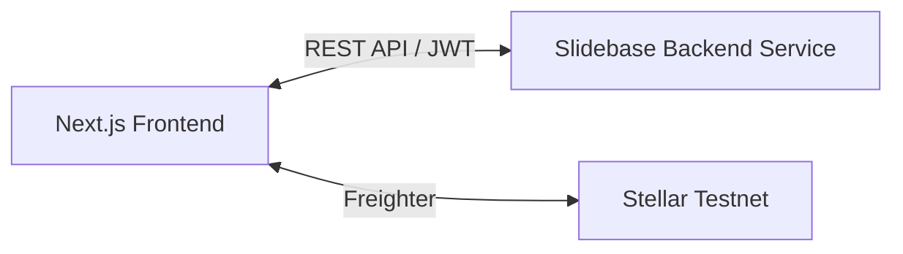

<div align="center">
  
  <h1>Slidebase Frontend</h1>
  <p><strong>AI-Powered Financial Automation on the Stellar Network</strong></p>

  <p>
    <a href="./LICENSE"></a>
    <a href="./CODE_OF_CONDUCT.md">Code of Conduct</a> |
    <a href="./SECURITY.md">Security Policy</a> |
    <a href="./CONTRIBUTING.md">Contributing</a>
  </p>

  <p>
    
    
    
    
  </p>

  <h3>
    <a href="https://autopilot-stellar-mauve.vercel.app/">🚀 Live Demo</a>
  </h3>
</div>

---

> **⚠️ This project runs on the Stellar Testnet only.**
> All transactions use test XLM with no real monetary value.

---

## 📖 Table of Contents

- [About](#-about)
- [Features](#-features)
- [Tech Stack](#-tech-stack)
- [Architecture](#-architecture)
- [Quick Start](#-quick-start)
- [Environment Variables](#-environment-variables)
- [File Structure](#-file-structure)
- [Testing](#-testing)
- [Backend API](#-backend-api)
- [Contributing](#-contributing)
- [Security](#-security)
- [License](#-license)

---

## 💡 About

This is the **frontend** application for Slidebase — an AI-powered financial automation platform built on the Stellar network.

The frontend is a [Next.js](https://nextjs.org/) application that provides users with a Web3 dashboard to:

- Connect their [Freighter wallet](https://www.freighter.app/)
- Create automation rules in natural language
- Track on-chain savings vaults and goals in real time
- Chat with an AI financial coach
- View real-time Stellar balances

It runs independently and talks to the separate Slidebase backend service via a REST API (`/api/*` proxied in `next.config.ts`).

---

## ✨ Features

| Feature | Description |
| :--- | :--- |
| 🗣️ **Natural Language Rules** | Type rules in plain English — the AI translates them into executable financial logic. |
| 🏦 **Automated On-Chain Vaults** | Instantly create isolated Stellar accounts for savings and investments. |
| 🎯 **Goal Tracking** | Set financial goals (e.g., "Emergency Fund") and link them to automation rules for automatic progress. |
| 🤖 **AI Financial Coach** | Chat with an AI coach to get rule suggestions based on your financial situation. |
| 📊 **Dynamic Dashboard** | Real-time Stellar balances and automated transaction history. |
| 🛡️ **Spending Limits** | Daily and weekly limits prevent automation from over-spending. |
| 📱 **Responsive Design** | Fully responsive — works seamlessly on mobile and desktop. |

---

## 🛠️ Tech Stack

| Category | Technology | Purpose |
| :--- | :--- | :--- |
| **Framework** | Next.js, React | App Router, Server Components, fast UI |
| **Styling** | Tailwind CSS | Utility-first responsive styling |
| **Stellar** | @stellar/stellar-sdk, @stellar/freighter-api | Wallet connection & chain data |
| **Database** | Prisma + Neon (PostgreSQL) | Session/rule persistence |
| **AI** | @google/generative-ai | Client-side AI features |
| **Animations** | framer-motion | Polished UI transitions |
| **Analytics** | @vercel/analytics | Usage insights |

---

## 🏗️ Architecture



The frontend proxies all `/api/*` requests to the backend service defined by `NEXT_PUBLIC_API_URL` (defaults to `http://localhost:3001`). See the [Backend API](#-backend-api) section for how the two services communicate.

---

## 🚀 Quick Start

### Prerequisites

| Tool | Version |
|------|---------|
| Node.js | >= 18 |
| npm | >= 9 |
| [Freighter Wallet](https://www.freighter.app/) | Browser extension (Testnet mode) |
| Slidebase backend | Running on `http://localhost:3001` |

### 1. Clone

```bash
git clone <this-repo-url> slidebase
cd slidebase
```

### 2. Install & Configure

```bash
npm install
cp .env.example .env.local   # Fill in your values
```

### 3. Run

```bash
npm run dev                   # Starts on http://localhost:3000
```

---

## 🧪 Testing

```bash
npm run lint                  # ESLint checks
npm run build                 # Production build
```

---

## 🌐 Environment Variables

| Variable | Description | Default |
| :--- | :--- | :--- |
| `NEXT_PUBLIC_API_URL` | URL of the Slidebase backend service | `http://localhost:3001` |
| `DATABASE_URL` | PostgreSQL connection string (used by Prisma scripts) | — |

---

## 📂 File Structure

```text
slidebase/
├── src/
│   ├── app/              # Next.js App Router pages
│   └── components/       # Reusable UI components
├── prisma/               # Prisma schema & migrations
├── public/               # Static assets (logo, etc.)
├── assets/               # README screenshots
├── next.config.ts        # Next.js config + API proxy rewrites
├── package.json
└── ...
```

---

## 🔌 Backend API

This frontend consumes the REST API provided by the separate **Slidebase Backend** service. The `next.config.ts` rewrites proxy all `/api/*` calls to the backend.

**Request flow:**

```
Browser → Next.js (/api/*) → Backend (Fastify) → PostgreSQL / Stellar / Groq
```

Both the backend and the Soroban smart contract (`AutopilotVault`) live in the original AutoPilot monorepo.

---

## 🤝 Contributing

We welcome all contributions!

1. Read the [Contributing Guide](CONTRIBUTING.md)
2. Check open issues
3. Fork → branch → PR

Please follow the [Code of Conduct](CODE_OF_CONDUCT.md).

---

## 🔐 Security

Slidebase handles Stellar keypairs and user funds. If you find a security vulnerability, **please do not open a public issue.** Instead, use [GitHub Security Advisories](https://github.com/thisisouvik/autopilot/security/advisories/new).

See [SECURITY.md](SECURITY.md).

---

## 📝 License

This project is licensed under the **MIT License** — see [LICENSE](LICENSE) for details.